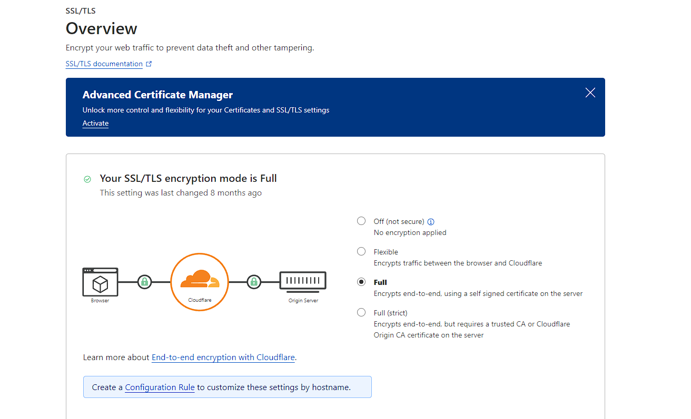

# ScriptVPS

Ini adalah [Marzban](https://github.com/Gozargah/Marzban) yang sudah saya tambahkan nginx untuk konfigurasi WebSocket single port. </br>
WebSocket sudah support untuk 443 TLS, 80 HTTP dan Wildcard path, contoh /enter-your-custom-path/trojan </br>

Disclaimer: Proyek ini hanya untuk pembelajaran dan komunikasi pribadi, mohon jangan menggunakannya untuk tujuan ilegal. </br>
Credit full to [Gozargah Marzban](https://github.com/Gozargah), saya hanya edit sedikit untuk instalasi sederhana bagi pemula . </br>

# List Protocol yang support
- VLess
- VMess
- Trojan
- ShadowSocks (To Be added)

# Yang harus dipersiapkan
- VPS dengan minimal spek 1 Core 1 GB ram
- Domain yang sudah di pointing ke CloudFlare
- Pemahaman dasar perintah Linux

# Sistem VM yang dapat digunakan
- Debian 10 </br>
- Debian 11 </br>
- Ubuntu 18.04 </br>
- Ubuntu 20.04 </br>
- Ubuntu 22.04 </br>


# Instalasi
  ```html
 apt-get update && apt-get upgrade -y && apt dist-upgrade -y && update-grub && reboot
 ```
Pastikan anda sudah login sebagai root sebelum menjalankan perintah dibawah
 ```html
 wget https://raw.githubusercontent.com/cerdasbarus/ScriptVPS/main/mar.sh && chmod +x mar.sh && ./mar.sh
 ```
 
Setelah instalasi berhasil, Panel login / Admin bisa ditambahkan dengan command
```html
marzban cli admin create --sudo
 ```
Buka panel Marzban dengan mengunjungi https://domainmu/dashboard <br>
Username dan Password default panel adalah :
- Username : admin
- Password : admin

Jika ingin mengubah konfigurasi env variable 
```html
nano /opt/marzban/.env
 ```
Perintah Restart service Marzban 
```html
marzban restart
 ```
Perintah Cek Logs service Marzban 
```html
marzban logs
 ```
Perintah Cek update service Marzban
```html
marzban update
 ```
# Cloudflare Sett

Pastikan SSL/TLS Setting pada cloudflare sudah di set menjadi full
 </br>

Lalu pada tab **Network** pastikan gRPC dan WebSocket sudah ON 


# Setting Host Marzban
 
 Saat masuk ke panel, setting host di menu kanan atas <br>
  </br>

Lalu ubah variabel {SERVER_IP} dibawah menjadi domain yang sudah di pointing tadi <br>
# TROJAN WS

# VMESS WS

# VLESS WS

</br>

Jika ada typo atau saran bisa PM ke saya di :<a href="https://t.me/cerdascharo" target=”_blank”></a><br>
<br>
Jika anda berminat bisa join ke Telegram channel saya di :<a href="https://t.me/cerdascharo" target=”_blank”></a><br>
<br>

Ready VPN Xray-Core, <br>

- Paket Reguler : https://t.me/cerdascharo

</br>
